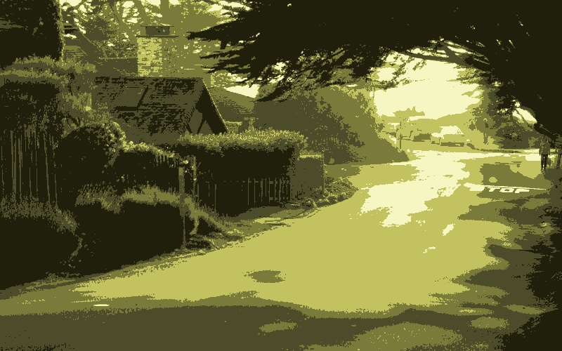

## Color Quantization Using K-Means
Following closely the colour quantization by [Adrian Rosebrock](http://www.pyimagesearch.com/2014/05/26/opencv-python-k-means-color-clustering/) I have written by own version in C/C++, and an alternate representation of the 
colour histogram.

To run the code: 

```
$ mdkir build
$ cd build
$ cmake ..
$ make
$ ./color_quantization ../test_img1.jpg 5
```
The output would be something like the figures below. The k-mean quantized image is saved as kmeans.jpg and the corresponding histogram is saved as hist.jpg
 
 test_image:
 

 K-means quantized:
 

 histogram
 
